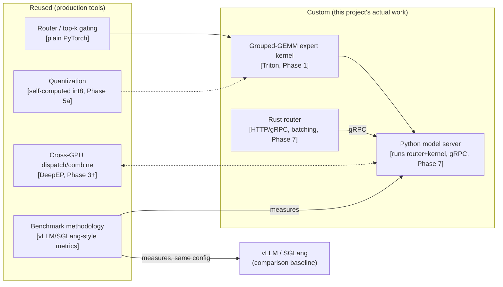

# dispatch

[](https://github.com/bsreecharanreddy/dispatch/actions/workflows/ci.yml)


An **inference engine for the token-routing layer of Mixture-of-Experts
(MoE) language models** — the architecture nearly every frontier model now
uses (DeepSeek, Llama, Mixtral, Grok, Qwen). A router sends each token to a
handful of specialist sub-networks ("experts") out of many; the hard
engineering problem is making that dispatch fast in practice — a custom GPU
kernel, multi-GPU expert-parallel serving, disaggregated prefill/decode —
not just correct on paper.

This project writes a real custom Triton kernel for that dispatch step,
gets it running across multiple real GPUs, and reports the result against
production serving-engine methodology (vLLM, SGLang) on rented hardware:
throughput, latency, and cost per million tokens, never estimated.

**No number in this README is quoted unless it was measured.** Where a
result was a null or a mixed one, it's reported that way.

---

> **Status:** Phases 0-4 merged to `main` across four PRs
> ([#1](https://github.com/bsreecharanreddy/dispatch/pull/1) Phase 0,
> [#2](https://github.com/bsreecharanreddy/dispatch/pull/2) Phase 1,
> [#3](https://github.com/bsreecharanreddy/dispatch/pull/3) Phases 2-3,
> [#4](https://github.com/bsreecharanreddy/dispatch/pull/4) Phase 4) —
> Phase 2 landed as docs only, its actual contribution being the
> upstreamed vLLM PR below, not a dispatch-repo code change. **Phase 5a
> (int8 weight-only quantization) is complete** on its own branch, PR
> pending. Full task-by-task record:
> [`docs/STATUS.md`](docs/STATUS.md). Design and phasing:
> [`docs/design/2026-09-14-dispatch-system-design.md`](docs/design/2026-09-14-dispatch-system-design.md).

## In sixty seconds

**What it does.** A pure-PyTorch reference MoE forward pass, a from-scratch
Triton grouped-GEMM kernel checked against it on real hardware before any
speed claim, real 2-to-4-GPU expert-parallel serving over DeepSeek's own
DeepEP library, and a disaggregated prefill/decode scheduler — each phase's
thesis stated up front and reported honestly, including the phases where
the answer was a null or mixed result.

**Built solo, start to finish** — design docs, the kernel, the multi-GPU
serving path, an upstreamed open-source benchmark contribution, every
rented-GPU session, and the write-ups of what broke along the way.

**Measured across seven rented-GPU sessions (six phases), $27.69 total,
all under their stated caps:** a custom Triton kernel **~65-73% faster** than DeepSeek's own
stock MoE forward pass at perfect logit agreement (Phase 1); an opt-in
skewed-load benchmark flag upstreamed to vLLM, changing which kernel config
its own tuner picks at 4 of 5 tested batch sizes (Phase 2); a real 2-GPU
DeepEP-backed expert-parallel path, byte-exact against a single-GPU
reference, that also *disproved* this project's own kernel-crossover
hypothesis at real scale (Phase 3); a disaggregated prefill/decode
topology across 4 real GPUs that returned a genuinely mixed result rather
than a forced win (Phase 4); and an int8 weight-only quantized kernel that
cut expert-weight memory **49.89%** at perfect model-level agreement, while
also surfacing and fixing a real bug where the naive quantized path was
holding both the bf16 and int8 copies in memory at once (Phase 5a).

**119 tests, `make check` green throughout Phase 5a** (lint, `mypy --strict`,
and the full non-GPU suite) — GPU-dependent tests are marked and excluded
from CI by design, then run for real on rented hardware every phase.

## Why this project

Nearly every frontier MoE model gets its capacity-per-compute win from the
same mechanic: route each token to a few experts out of many, and make that
routing fast under wildly skewed per-expert token counts. That kernel and
the serving system around it is a specific, in-demand skill set —
inference engineering, the kind OpenAI, Anthropic, and NVIDIA hire for
under that title — distinct from training a model or building a
data/ML platform.

**The router and the cross-GPU communication layer are both solved,
production-grade problems** — DeepSeek's own DeepEP library does the
all-to-all dispatch/combine, and top-k gating is plain PyTorch. The
differentiated work this project actually does is the grouped-GEMM expert
kernel itself and the serving system built around it — not reinventing
either solved piece. Three decisions carry that scoping, each checked
against real current material before being made, not assumed:

- **[ADR-0001](docs/adr/0001-grouped-gemm-kernel-over-attention-kernel.md)**
  — a grouped-GEMM expert kernel over another from-scratch attention-kernel
  reimplementation, a pattern already saturated on GitHub.
- **[ADR-0002](docs/adr/0002-deepep-over-hand-rolled-communication.md)** —
  DeepEP over hand-rolled cross-GPU communication, and the real NVLink/SXM
  hardware constraint that follows it into Phase 3's cost.
- **[ADR-0003](docs/adr/0003-rust-router-over-python-only-server.md)** — a
  Rust router in front of the Python model server (Phase 7), mirroring
  Hugging Face's own `text-generation-inference` three-tier split, added
  after checking real inference-engineer postings against the original
  design and finding real gaps it didn't cover.

Positioned deliberately differently from this author's other portfolio
projects: `almanac` is a data + ML platform, `canopica` is a governed
decision system with an AI capability layer, `dispatch` is the GPU-systems
piece neither of them touches.

## The centerpiece

**Correctness before speed.** A kernel is not "fast" until it has been
proven numerically correct against a reference implementation within a
stated tolerance — a kernel that's fast because it's silently wrong is a
bug, not a result, and it's invisible unless the correctness check is
explicit. Every phase below follows the same build order: reference
implementation first, correctness gate against it on real hardware second,
a speed or scaling claim only after that gate passes. Phase 3's own kernel
crossover hypothesis failed to reproduce at real scale — found *because*
the correctness gate ran before the benchmark did, not after.

## Architecture — what's custom vs. reused



The differentiated work is the grouped-GEMM kernel and the serving system
around it. Phases 0-6 drive the kernel and model directly from lightweight
Python test/benchmark harnesses; the Rust-router/Python-model-server split
is Phase 7's contribution, once there's a real service worth
productionizing.

## What has been measured

Each phase started with a stated thesis and reported the real answer,
including the ones that came back null or mixed:

| Phase | Thesis tested | Measured result |
|---|---|---|
| **0 — baseline** | What does `deepseek-ai/deepseek-moe-16b-base` actually cost per token, unpatched, on one rented GPU? | bf16, single L40, unbatched eager decode: **12.75 tok/s, 0.355s mean TTFT** (p50 0.258s, p99 1.588s). **$0.35** total, three attempts included |
| **1 — grouped-GEMM kernel** | Does a custom Triton grouped-GEMM kernel beat DeepSeek's own stock `moe_infer`, and does a persistent/cache-aware variant beat the naive one? | Naive kernel **+67.2%** (12.55 → 20.98 tok/s), persistent **+65.7%** — both at perfect mutual top-5/top-1 logit agreement. Persistent **ties** naive at the 1-token/step granularity that actually drives decode (a null result the plan predicted before the run), wins 3-8% at 16-128 tokens, loses up to 14% at 512-2048 |
| **2 — vLLM contribution** | Do vLLM's or SGLang's official MoE benchmarks model skewed (zipf) expert load? | Neither did. Upstreamed an opt-in `--expert-load-distribution` flag to vLLM; on one rented RTX 3090, `--tune` under zipf vs. uniform routing picks a **different winning Triton config at 4 of 5 tested batch sizes**. Open: [vllm-project/vllm#57100](https://github.com/vllm-project/vllm/pull/57100) |
| **3 — multi-GPU EP** | Does Phase 1's naive-vs-persistent crossover hold under DeepEP's real per-expert token distribution across GPUs? | **It doesn't apply at real scale.** Naive wins at every tested token count (16-2048) on H200, independent of EP. Real DeepEP dispatch across the model's 27 MoE layers produces per-local-expert counts (median 2, max ~20) far below Phase 1's smallest tested point (16) |
| **4 — disaggregated prefill/decode** | Does separating prefill and decode across GPU pools relieve contention, holding GPU count fixed at 4? | **Mixed, not a clean result.** Disaggregated TTFT beats co-located at concurrency 4 (0.46s vs 1.12s) but loses at concurrency 8 (0.98s vs 0.70s) — most likely a kernel-warmup confound between independent process launches, reported as genuinely inconclusive rather than forced |
| **5a — int8 quantization** | Does a self-computed, per-channel int8 weight-only kernel cut memory with no model-level correctness cost? | **Yes on both counts, no speedup.** **49.89%** expert-weight memory reduction, perfect top-1/mutual-top-k agreement vs. the naive bf16 kernel at every tested position. Throughput was a near-exact tie with naive (**-1.2%**), as expected — weight-only quantization saves memory bandwidth, not FLOPs. A real bug (quantizing without freeing the original bf16 weights, OOMing a 44GB L40) was found and fixed mid-session |

Full method and every number: one findings doc and one cost doc per phase
in [`docs/findings/`](docs/findings/).

## What it does not do

Stated here rather than left for a reader to discover — from the design
doc's own scope boundaries:

- **Does not train or fine-tune the model.** DeepSeekMoE-16B's published
  weights are used as-is.
- **Does not generalize the kernel to other MoE architectures** in this
  pass — proving the mechanic on one real model is the scope; generalizing
  it is a possible later phase, not a Phase 0-7 requirement.
- **Does not run a production autoscaling or fleet-management layer.**
  Phase 7's Kubernetes deployment is applied for real once, verified, and
  torn down — it does not keep a service running continuously.
- **Does not reimplement DeepEP, quantization algorithms, or the model's
  own forward pass from scratch.** Those are solved problems this project
  deliberately reuses; Rust (Phase 7) is scoped to the router only.
- **Does not chase the enterprise-ML-integration profile** — that territory
  is deliberately `almanac`'s, not this project's.

## Stack

| Layer | Choice |
|---|---|
| Model | `deepseek-ai/deepseek-moe-16b-base` — 16.4B params, fine-grained MoE, shared + routed experts |
| Kernel | Custom Triton grouped-GEMM (naive + persistent/cache-aware), int8 weight-only quantization (Phase 5a) |
| Multi-GPU | DeepSeek's DeepEP — real all-to-all expert-parallel dispatch/combine over NVLink/SXM |
| Serving | Continuous-batching prefill/decode workers, both co-located and disaggregated topologies |
| Benchmark methodology | vLLM/SGLang-style metrics — TTFT, inter-token latency, tokens/sec, cost per million tokens |
| Language | Python 3.12+ — `uv`, `ruff`, `mypy --strict`, `pytest` |
| GPU provisioning | RunPod's API via lightweight scripts (`scripts/gpu/`) — not Terraform; see `CLAUDE.md`'s cost discipline |
| CI | GitHub Actions — lint, `mypy --strict`, and the non-GPU suite on every push |

## Layout

```text
src/dispatch/
  benchmark/        metrics, generation harness, reference-logit capture/comparison
  kernels/          reference MoE, Triton grouped-GEMM (naive + persistent), int8 quantization,
                    expert-parallel sharding, backend registry
  serving/          KV-cache slice/handoff, continuous-batching prefill/decode, co-located worker
scripts/
  run_baseline.py       latency/throughput CLI, stock or kernel-patched, --compare-reference gate
  run_kernel_bench.py   pure kernel micro-benchmark, refuses to time a backend that disagrees
  gpu/                  RunPod API client, provisioning CLI, pod-live correctness/concurrency scripts
tests/              unit + integration; `gpu`-marked tests need real CUDA, excluded from CI
docs/design/        the authoritative architecture, phase plan, and scope document
docs/adr/           decisions, each checked against real current material before being made
docs/plans/         per-phase implementation plans, written before any code
docs/findings/      measured results and costs — one run doc and one cost doc per phase
docs/runbooks/      the exact GPU-session steps each phase's real run followed
```

## Running it

```bash
uv sync --all-extras --dev
make check       # lint + mypy --strict + the non-GPU test suite -- same as CI
make check-fast  # inner loop, also skips slow-marked tests
```

GPU-dependent tests (`pytest -m gpu`) need a real CUDA device and are
excluded from both targets by design — this repo's CI has no GPU runner.
They're run for real on rented hardware every phase; each phase's findings
doc in [`docs/findings/`](docs/findings/) records exactly which GPU, for
how long, and at what cost.

## Design and the paper trail

[`docs/design/2026-09-14-dispatch-system-design.md`](docs/design/2026-09-14-dispatch-system-design.md)
is the authoritative architecture, phasing, and scope document.

| | |
|---|---|
| [`docs/STATUS.md`](docs/STATUS.md) | the verification log, at task granularity, updated in the same commit as the work |
| [`docs/adr/`](docs/adr/) | three decisions, each citing the real material that settled it |
| [`docs/findings/`](docs/findings/) | the measurements themselves, one run doc and one cost doc per phase |
| [`docs/plans/`](docs/plans/) | per-phase implementation plans, written before any code |
| [`docs/runbooks/`](docs/runbooks/) | the exact GPU-session steps each phase's real run followed |

## Who should look at what

- **Inference / GPU-systems engineering** — the kernel itself
  (`src/dispatch/kernels/grouped_gemm.py`), then
  [Phase 1's findings doc](docs/findings/2026-09-15-phase-1-grouped-gemm-run.md):
  a from-scratch Triton kernel proven correct on real hardware before a
  single speed claim was made.
- **Distributed / multi-GPU systems** — `src/dispatch/kernels/expert_parallel.py`
  and `src/dispatch/serving/`, then
  [Phase 3's](docs/findings/2026-09-16-phase-3-multi-gpu-ep-run.md) and
  [Phase 4's](docs/findings/2026-09-17-phase-4-disaggregated-prefill-decode-run.md)
  findings docs for two results — one null, one mixed — found by measuring
  on real hardware rather than assumed.
- **ML infra / open-source contribution** —
  [Phase 2's findings doc](docs/findings/2026-09-15-phase-2-vllm-benchmark-run.md)
  and the open [vLLM PR](https://github.com/vllm-project/vllm/pull/57100): a
  real gap found by checking what a production project already ships, not
  duplicating it.
- **Anyone checking whether the claims hold** — [`docs/STATUS.md`](docs/STATUS.md)
  and [`docs/findings/`](docs/findings/), where a null or mixed result
  (Phase 1's persistent-kernel tie, Phase 3's crossover disappearing,
  Phase 4's inconclusive disaggregation number) is reported as such rather
  than smoothed over.

`CLAUDE.md` is instructions for AI coding assistants working in this repo,
not a document for a human evaluating the project.

## Why the name

"Dispatch" is the literal term for the MoE routing step this project
builds a kernel for — each token sent to a handful of expert sub-networks
out of many. It's also, not incidentally, what this project does with
every rented GPU session: dispatch the work, measure it, tear it down.

## License

Dual-licensed under either [MIT](LICENSE-MIT) or
[Apache-2.0](LICENSE-APACHE), at your option.
