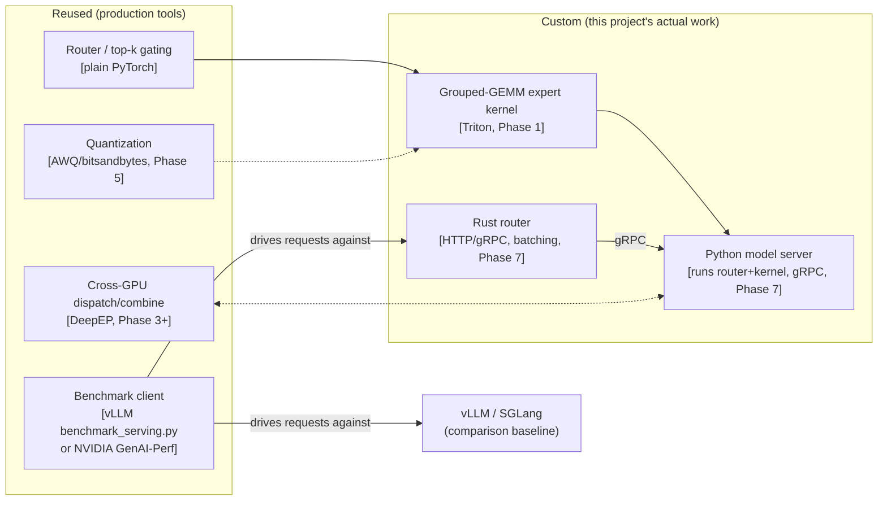

# dispatch — system design

Status: draft, second pass (Phase 7 + Rust serving layer added). Written
2026-09-14 after a brainstorming session covering role targeting, project
shape, cost planning, and naming. Architecture decisions below were checked
against current (2026-09) public material before being written down —
sources are cited inline, per this project's standing "search before
deciding" convention.

## 1. Purpose

Build a real inference engine for the token-routing layer of a
Mixture-of-Experts (MoE) language model: a custom GPU kernel for the expert
compute, real multi-GPU expert-parallel serving, and a benchmark against
production serving engines (vLLM, SGLang) on real, measured numbers. The
goal is a portfolio artifact that demonstrates the specific skills current
inference-engineering job postings at OpenAI, Anthropic, and NVIDIA name
explicitly — not a tutorial replica of something already common (see
`docs/adr/` for what was ruled out and why).

## 2. Model

**deepseek-ai/deepseek-moe-16b-base** — 16.4B total parameters, fine-grained
expert segmentation with shared + routed experts, ~40% of the compute of a
comparable dense 7B model. Confirmed on Hugging Face: 32.8GB of weights
across 7 safetensors files.

Checked against the realistic alternatives as of 2026-09 rather than assumed:
Qwen1.5-MoE-A2.7B is a similar-scale option; Nemotron 3.5 Lightning (Aug
2026, NVIDIA) is a newer hybrid Mamba-2/MoE/attention model but its
non-pure-MoE architecture muddies the "expert dispatch kernel" story; Mistral
Small 4 (119B, ~74GB even at Q4) and Llama 4 Scout (109B) both rule
themselves out for single-GPU work. DeepSeekMoE-16B stays the pick: it's the
architecture lineage DeepSeek scaled into DeepSeek-V3, real weights are
public, and it's the smallest model that's still a "real" MoE story rather
than a toy.

**Memory note:** 32.8GB of weights on a 40GB GPU leaves limited headroom for
activations/KV-cache at larger batch sizes. Phase 0 measures exactly how
much batch size that leaves before deciding whether later benchmark phases
need an 80GB card instead — not assumed up front.

## 3. Architecture — what's custom vs. reused

The router (top-k expert selection) and the cross-GPU communication layer
are both solved problems with production-grade open implementations — the
differentiated work is the grouped-GEMM kernel and the serving system built
around it, not reinventing either of those. Phases 0-6 drive the kernel and
model directly from lightweight Python test/benchmark harnesses; the
Rust-router/Python-model-server split (§8) is Phase 7's contribution, once
there's a real service worth productionizing.

## 4. Kernel scope

The custom kernel targets **the grouped-GEMM expert computation** — running
all activated experts' matrix multiplications together in one kernel launch
instead of one slow GEMM per expert, which is where the literature says the
real performance is won or lost under skewed per-expert token counts
(PyTorch engineering blog, 2026; see ADR 0001).

Build order, correctness before speed (this project's non-negotiable, see
CLAUDE.md):

1. **Reference.** Phase 0's plain PyTorch/HF forward pass is the numerical
   ground truth every later kernel version is checked against, within a
   stated tolerance.
2. **Naive Triton grouped-GEMM**, built from Triton's own official Group
   GEMM tutorial as a starting point. Correctness-tested first.
3. **Persistent, cache-aware kernel** — the current state-of-the-art
   pattern (CTAs stay alive and pull new tiles rather than relaunching per
   group), per PyTorch's own 2026 engineering writeup. Benchmarked against
   both the naive kernel and the Phase 0 baseline, single GPU only.

## 5. Multi-GPU expert-parallel serving

**Finding that changed this section's design:** DeepSeek's own DeepEP
library (MIT-licensed, open source) is purpose-built for this exact
problem — high-throughput, low-latency all-to-all dispatch/combine kernels
for expert parallelism, with FP8 support. Using it instead of hand-rolling
cross-GPU communication is the right call for the same reason the router
isn't hand-rolled: it's a solved, hard, separate problem from the kernel
work this project is actually demonstrating.

**Real constraint found in the same research pass, not to be glossed
over:** DeepEP needs NVLink (SXM-form-factor GPUs) within a node, or
InfiniBand across nodes, for its fast NVSHMEM path — a plain PCIe multi-GPU
box (the kind the cheap Vast.ai/RunPod marketplace tier usually offers)
does not get DeepEP's real performance. This directly affects Phase 3's
cost: it needs a short, deliberate burst on a dedicated NVLink/SXM
multi-GPU rental (RunPod Secure Cloud or Lambda, not marketplace spot),
priced and time-boxed as its own line item — not assumed to fall out of
the same cheap instances the rest of the project uses. See §9 cost plan.

**Noted for Phase 3, not decided now:** UCCL-EP (a newer, cloud-flexible
expert-parallelism library surfaced in the same research pass) may relax
the NVLink requirement — worth a real evaluation at Phase 3 time against
actually-rented hardware, not decided speculatively here.

## 6. Benchmark methodology

Using an existing standard tool rather than a bespoke script, so the final
numbers are something a reader can trust and reproduce: **vLLM's
`benchmark_serving.py`** (works against any OpenAI-compatible server —
vLLM, SGLang, TensorRT-LLM, and this project's own server) or **NVIDIA's
GenAI-Perf**. Standard metrics: time-to-first-token, inter-token latency,
end-to-end latency, tokens/sec, requests/sec, and cost per million tokens
(computed from the measured GPU-hour rate, never estimated).

Every comparison runs vLLM/SGLang and this project's server against the
**same model, same hardware, same request trace** — an apples-to-apples
requirement, not a nice-to-have.

> **Amended 2026-09-18 (Phase 6 design).** "This project's server" was
> never built through Phase 5b: dispatch's engine is an in-process
> Hugging Face eager decode loop with the MoE layer patched, so a
> serving-benchmark race against vLLM/SGLang would measure that gap rather
> than the kernel. Phase 6 instead runs a like-for-like kernel-level race
> plus a labeled engine reference; see
> `docs/design/2026-09-18-phase-6-final-benchmark.md`. A real dispatch
> server belongs to Phase 7 (§8).

## 7. Phase plan

| Phase | What | Cost shape |
|---|---|---|
| 0 | Baseline: DeepSeekMoE-16B via plain HF `transformers` on one rented GPU; honest measured latency/throughput becomes the correctness reference and the "before" number | Cheap, single GPU, develop on free tier first where possible |
| 1 | Custom Triton grouped-GEMM kernel, single GPU: naive → correctness-tested → persistent/cache-aware, benchmarked | Cheap, single GPU |
| 2 | Attempt an upstream PR (vLLM or SGLang) — starts by finding a real gap in what they already ship, not duplicating it | No GPU cost beyond re-verifying against their harness |
| 3 | Multi-GPU expert-parallel serving: DeepEP (cross-GPU dispatch) + this project's kernel (local compute) | The expensive line item — short, deliberate burst on rented NVLink/SXM multi-GPU, timeboxed |
| 4 | Disaggregated prefill/decode across separate GPU pools | Reuses phase 3's NVLink/SXM rental where possible; shorter burst |
| 5 | Quantization + speculative decoding layered on top (existing tooling) | Single/dual GPU |
| 6 | Final benchmark vs. vLLM/SGLang, standard tool, same hardware/model | Whatever phases 3-4's hardware already required, reused |
| 7 | Productionization: Rust router + Docker + observability + a K8s deployment, demoed once | Small — a single GPU (or even CPU for the router alone) is enough; K8s demoed once and torn down, not run continuously |

## 8. Phase 7: productionization

Added after checking real inference-engineer job postings (national) and
the Atlanta metro market specifically — both name gaps this design didn't
originally cover: containerization, cloud/K8s deployment, and live
observability against SLA-style metrics (TTFT, tokens/sec) rather than a
one-shot benchmark number.

**Rust router, Python model server — the TGI architecture, not invented
here.** Checked directly against Hugging Face's own documented
`text-generation-inference` architecture: a three-tier split of Launcher,
Router (Rust — HTTP-facing, request validation, queuing, continuous
batching), and Server (Python — loads the model, runs inference), talking
over gRPC. Dispatch follows the same split rather than a novel one:

- **Router (Rust)** — HTTP/gRPC-facing, request queuing and batching,
  Prometheus metrics exposition (TTFT, inter-token latency, queue depth,
  requests/sec). This is deliberately the "last mile" layer 2026 production
  practice actually puts in Rust (no GIL, no interpreter overhead,
  deterministic latency) — see ADR-0003 for the full reasoning and what
  was deliberately *not* rewritten in Rust.
- **Model server (Python)** — unchanged from phases 0-6: loads
  DeepSeekMoE-16B, runs the router/gating + the custom Triton kernel +
  DeepEP where applicable, serves gRPC requests from the Rust router.

**Docker.** Both processes containerized; a `docker compose` (or two
Dockerfiles) brings up router + model server together for local
verification before any cloud deployment.

**Observability.** Router-exposed Prometheus metrics, a Grafana dashboard
showing TTFT/ITL/throughput/queue-depth live during a benchmark run —
turns Phase 6's one-shot benchmark numbers into something that looks like
a monitored service, not just a script's stdout.

**Kubernetes.** A deployment manifest (or a small Helm chart), applied for
real against a real cluster once, health-endpoint verified, screenshotted,
torn down immediately — the same "apply it for real, prove it, tear down"
pattern Canopica used for its Azure proof, not a service left running.

## 9. Cost plan

Recap from the brainstorming session, now tied to real phases: marketplace/
spot instances for phases 0, 1, 2, 5; a dedicated NVLink/SXM multi-GPU
rental for the short phases 3-4 bursts specifically (not assumed to be free
or already covered by the cheap tier); a single cheap GPU (or CPU-only for
the router itself) for phase 7's Docker/K8s demo. Budget cap set before the
first rental. Every run's cost measured and logged to `docs/findings/`,
never estimated. Full discipline in CLAUDE.md's Cost discipline section.

## 10. What "done" looks like

- Kernel numerically correct within a stated tolerance vs. the Phase 0
  reference, at every optimization step.
- Every benchmark claim carries its config (batch size, sequence length,
  hardware, quantization level) alongside the number.
- Multi-GPU expert-parallel serving demonstrably working, benchmarked
  against single-GPU.
- A same-hardware, same-model comparison table against vLLM and/or SGLang.
- A containerized, K8s-deployable service with live observability, proven
  by one real deploy-verify-teardown cycle.
- (Stretch, not required for "done") an upstream PR opened; bonus if
  merged.

## 11. Explicitly out of scope

- Training or fine-tuning the model itself.
- Supporting arbitrary models beyond DeepSeekMoE-16B in the first pass —
  generalizing the kernel to other MoE architectures is a possible later
  phase, not a Phase 0-7 requirement.
- A production autoscaling/fleet-management layer, or a K8s deployment run
  continuously. Phase 7 proves the deployment mechanics once; it does not
  keep a service running.
- Reimplementing cross-GPU communication (DeepEP's job), quantization
  algorithms (AWQ/bitsandbytes's job), or the model's own forward pass
  (PyTorch/HF's job) in Rust or anything else from scratch. Rust is scoped
  to the router only (§8, ADR-0003) — not a full-service rewrite.
- Chasing the Atlanta-metro enterprise-ML profile specifically (cloud-native
  ML integrated into existing business systems) — that territory is already
  covered by `almanac`. Phase 7 closes the national-posting gaps
  (Docker/K8s/observability) without turning this into a different project.

## 12. Open risks

- **NVLink/SXM rental availability and price** at the time Phase 3 actually
  runs — checked live then, not assumed from this doc.
- **Whether an upstream PR gets accepted** (Phase 2) is not within this
  project's control; "attempted and real, even if not merged" is still a
  valid outcome, per this doc's own §10.
- **DeepEP vs. UCCL-EP** — not fully resolved here; Phase 3 starts with a
  short evaluation against whatever hardware is actually rented.
- **Rust experience level.** Writing a production-quality async Rust
  server (even a scoped one) is a real skill investment if Rust is new —
  Phase 7 budgets calendar time for that learning curve rather than
  assuming it's free.
