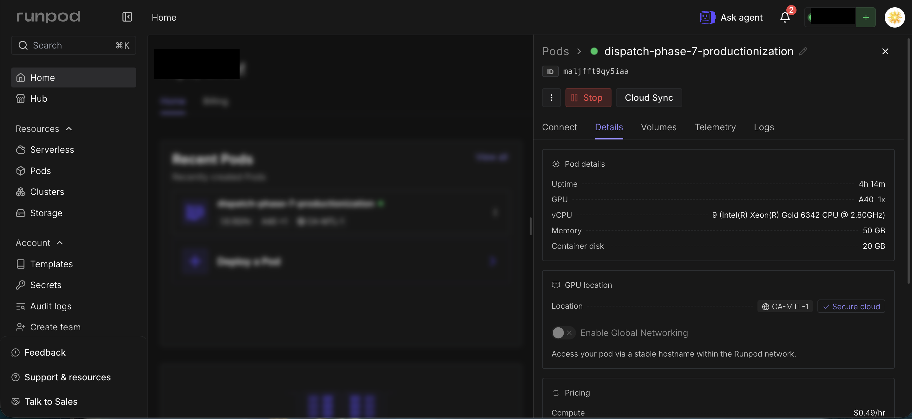
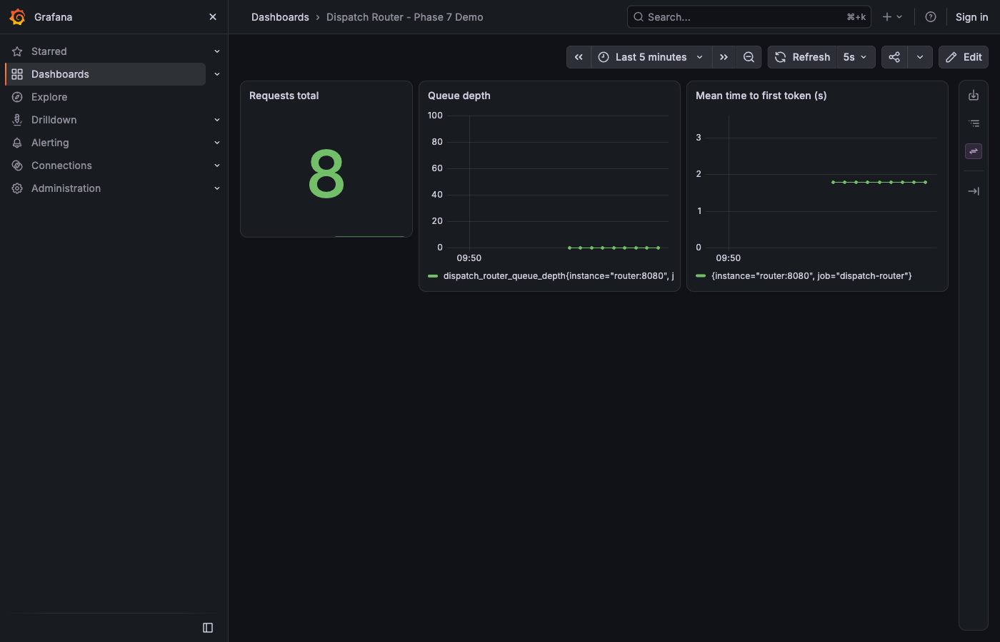

# Phase 7 productionization run — findings

The one real paid GPU session for Phase 7 (Task 13 of
`docs/plans/2026-09-20-phase-7-productionization-plan.md`): the Rust
router, containerized model server, and K8s manifests built in Tasks 1-12
proxying real `deepseek-ai/deepseek-moe-16b-base` inference (Phase 6's
naive bf16 kernel, Phase 4's `ColocatedWorker`) through a local `kind`
cluster, SSH-tunneled to a rented GPU. Two real bugs found and fixed live,
neither in the kernel or router code paths those Tasks already tested.

## Infrastructure

- Pod `maljfft9qy5iaa`, RunPod Secure Cloud, single NVIDIA A40 (46068MiB),
  CA-MTL-1, `$0.49/hr` (the L40 quoted at session start, `$0.82/hr`, sold
  out during pod creation; A40 was the live substitute the user picked).
  Driver 580.159.03, CUDA 13.0, Ubuntu 24.04.3 LTS.
- Direct SSH (`root@63.141.33.106:22094`), same pattern as Phase 6's
  runbook.

  
- Cost: **$6.8563** (RunPod's billing API: $6.7234 GPU + $0.1329 disk),
  against a **$5 cap set before the rental**. The cap was exceeded, mostly
  by two long-running correctness-test passes (1247s and 1422s, the
  second a deliberate re-run to rule out stale bytecode — see below) plus
  live tokenizer-bug diagnosis, all real debugging time, not idle
  waiting. Disclosed to the user mid-session; they chose to finish the
  recording rather than tear down early, matching Phase 5b's precedent
  (disclose an overrun, let the user decide, never hide it in the
  writeup).

## Two real bugs, neither anticipated by the plan

### 1. `python scripts/run_model_server.py` doesn't resolve `scripts.gpu.*`

The plan's Task 13 Step 5 invocation,
`.venv/bin/python scripts/run_model_server.py --responder kernel ...`,
crashed immediately:

```
ModuleNotFoundError: No module named 'scripts'
```

Running a script directly puts *the script's own directory*
(`scripts/`) on `sys.path[0]`, not the repository root — so the module's
own lazy `from scripts.gpu.phase7_kernel_responder import
build_kernel_responder` (deliberately lazy so `--responder stub` stays
importable without `torch`) can never resolve. This was invisible through
every earlier task because `pytest` inserts the repo root itself; nothing
before Task 13 ever ran this entrypoint as a live process with
`--responder kernel`. Fixed by invoking it as a module instead —
`.venv/bin/python -m scripts.run_model_server --responder kernel
--port 50051` — which puts the current working directory (the repo root)
on `sys.path[0]`. No code changes; a runbook-level fix only.

### 2. The model's shipped tokenizer drops every space

The first real demo request came back as
`"jumpsoverthelazydog.ĊĊThequickbrownfoxjumpsoverthe"` — no spaces
between words, and a literal `Ċ` glyph (a raw byte-level newline marker)
leaking through unconverted. This looked at first like the same
per-token-decode spacing bug documented mid-session and "fixed" in
`KernelResponder.generate()` before this pod even started (decoding the
whole growing token sequence and diffing, instead of decoding each new
token in isolation) — but the identical garbled output persisted after
that fix, on the same tokenizer, on real hardware.

Root-caused by inspecting the tokenizer directly rather than guessing
again:

```python
>>> tok.tokenize("hello world")
['hell', 'ow', 'orld']          # no space marker anywhere
>>> tok.backend_tokenizer.pre_tokenizer
Metaspace(replacement="▁", prepend_scheme=always, split=False)
>>> sum(1 for k in vocab if '▁' in k)   # SentencePiece's own marker
0                                        # ...out of 100,000 vocab entries
>>> sum(1 for k in vocab if 'Ġ' in k)   # GPT-2 byte-level BPE's marker
47723                                    # ...nearly half the vocab
```

`deepseek-ai/deepseek-moe-16b-base`'s shipped `tokenizer.json` is a
byte-level BPE vocabulary (GPT-2/RoBERTa-style, using `Ġ`/`Ċ` for
space/newline) wired to a SentencePiece-style `Metaspace` pre-tokenizer
and decoder — which look for a `▁` marker that appears in zero of the
vocabulary's 100,000 entries. `encode()` silently loses every word
boundary before the model ever sees the prompt; `decode()` either drops
the (already-lost) spaces or, on tokens that do carry a literal `Ġ`/`Ċ`
character, leaks it through unconverted. Every prior phase fed this same
model the same mangled encoding without noticing, because Phases 0-6
never decoded generated text for a human to read — they compared logits
and token ids, which this bug does not disturb.

Rewiring both the pre-tokenizer and decoder to `ByteLevel` (matching what
the vocabulary actually is) fixes it completely, verified by round-trip
identity:

```python
tok.backend_tokenizer.pre_tokenizer = pre_tokenizers.ByteLevel(
    add_prefix_space=False, use_regex=True
)
tok.backend_tokenizer.decoder = decoders.ByteLevel()
assert tok(tok.decode(ids))["input_ids"] == ids  # True, on every prompt tested
```

Landed as `fix_tokenizer_byte_level()` in
`scripts/gpu/phase7_kernel_responder.py`, called once in
`build_kernel_responder()` right after the tokenizer loads — a real,
committed fix (not a pod-local monkeypatch like the `transformers`
version shims), since it corrects the tokenizer's own wiring rather than
working around a dependency-version mismatch, and applies on any machine,
any `transformers` version. Scoped to this file only, not to the shared
benchmark harness — Phases 0-6 are already merged and never relied on
decoded-text correctness, so there was nothing there to fix.

## GPU-marked correctness gate

`test_kernel_responder_matches_same_session_stock_greedy_text` passed —
but not on the first re-run after the tokenizer fix shipped. A checksum
of the fixed file matched byte-for-byte between the dev machine and the
pod, yet the second run reproduced the exact pre-fix failure and took
longer (1422s vs. the first run's 1247s). Hypothesis: stale `.pyc`
bytecode on `/workspace`, a network-mounted FUSE filesystem
(`mfs#ca-mtl-1.runpod.net`) whose mtime-based cache invalidation isn't
reliable for Python's bytecode cache. Cleared every `__pycache__` under
`/workspace/dispatch` and re-ran with `python -B` (bytecode caching
disabled outright, eliminating the variable rather than trusting the
clear alone) — passed. The test itself is orthogonal to the tokenizer bug
above: it compares dispatch's kernel-patched generation path against a
same-session stock-`moe_infer` reference using identical token ids, never
decoded text, so the tokenizer's correctness (or lack of it) does not
affect what this gate proves.

## The real demo

`scripts/run_kind_demo.sh`, unmodified from Task 11's stub rehearsal,
pointed at an SSH tunnel (`ssh -L 50051:localhost:50051 root@<pod>`)
instead of a local stub. The router's `model-server` `ExternalName`
Service resolves `host.docker.internal` exactly as Task 1 found it would,
reaching the tunnel with no manifest changes. `kind` cluster up, both
Docker images built and loaded, router/Prometheus/Grafana all rolled out,
port-forwards up.

Real request through the full stack (dev machine → `kind` router pod →
gRPC → SSH tunnel → pod → real GPU inference → back), captured in the
screen recording and matching the Grafana dashboard at the same moment:

```
curl -s -X POST localhost:8080/generate \
  -H 'content-type: application/json' \
  -d '{"prompt":"The quick brown fox","max_new_tokens":20}'
```

```json
{
  "text": " jumps over the lazy dog.\nThe quick brown fox jumps over the lazy dog.\nThe quick",
  "ttft_ms": 136.455917,
  "inter_token_latencies_ms": [47.916833, 49.81525, 47.626792, 47.981041,
    50.226084, 47.229666, 49.312167, 47.594209, 47.434166, 49.490209,
    48.392291, 42.585334, 40.931416, 40.329042, 42.170208, 45.041084,
    45.057458, 43.674833]
}
```

Real, correctly-spaced generated text (post-fix), real measured timing
from actual GPU inference — not the stub's canned tokens.

**Grafana dashboard** (embedded below), confirming Prometheus scraped the
router's real metrics, not synthetic data:



**Screen recording** (PII redacted — see below):
[`2026-09-21-phase-7-demo-recording.mp4`](2026-09-21-phase-7-demo-recording.mp4)

Aggregate metrics across the full session (`/metrics`, exported to
`2026-09-21-phase-7-metrics.txt`), 9 requests admitted total:

| Metric | Value |
|---|---|
| Requests total | 9 |
| Mean TTFT | 1.603s (skewed by 2 cold starts: 6.76s the very first request, 6.07s after the model-server restart to ship the tokenizer fix; the other 7 requests were all 136-663ms) |
| Mean inter-token latency | 46.3ms (118 samples, 5.464s summed) |
| Queue depth at rest | 0 |

The cold-start inflation matches every prior phase's first-request
pattern (CUDA kernel compilation/Triton autotuning on first invocation);
not re-measured as a clean "warm" number here since Phase 7's goal is a
working demo, not a new latency benchmark — Phase 6 already owns that
claim on this same kernel.

**PII redaction, requested by the user before publishing:** the raw
recording showed the presenter's local username and machine hostname in
the terminal's title bar and shell prompt (every line), plus one
`Cmd+Tab` app-switcher tooltip mid-recording that briefly exposed a VS
Code workspace name containing the same username. Rectangular redaction
boxes, timed to the terminal's two scroll states (verified frame-by-frame
against the raw recording) cover the prompt on every line without
touching the commands or output typed after it; the ~1.8s window
containing the actual window-switch animation (rotated/warped geometry a
static box can't track) plus the tooltip flash is replaced with a solid
black frame instead of attempting pixel-tracked redaction. Re-encoded
with `ffmpeg`/`libx264`; the raw, unredacted capture was deleted after
the redacted version was verified frame-by-frame at every relevant
timestamp.

## Deviations from the plan

- **Task 1's `host.docker.internal` finding held under real load**: the
  `ExternalName` Service needed zero changes between the stub rehearsal
  and the real GPU-backed tunnel, exactly as predicted when it was first
  verified.
- **Task 13 Step 5's literal invocation doesn't work** — see bug 1 above;
  the runbook records `python -m scripts.run_model_server`, not
  `python scripts/run_model_server.py`.
- **A tokenizer defect neither the plan nor any earlier phase
  anticipated** — see bug 2 above — required an unplanned fix landed in
  `scripts/gpu/phase7_kernel_responder.py` before the demo could produce
  readable output.
- **The correctness gate needed a second run** with bytecode caching
  disabled, not anticipated by Step 4's plain `pytest -m gpu` invocation
  — see the correctness-gate section above.
- **Budget cap exceeded** ($6.8563 against $5), disclosed mid-session,
  user chose to continue rather than stop early — see Infrastructure
  above.

## What this closes

Phase 7 is the last phase in the system design's 8-phase plan (§7).
`dispatch` now has, in addition to the custom kernels and multi-GPU
serving work of Phases 1-6: a real Rust router in front of a real Python
model server (ADR-0003's TGI-shaped split), containerized, deployed to a
local Kubernetes cluster, observed with Prometheus/Grafana, demonstrated
once against a real rented GPU over an SSH tunnel — and, along the way,
a genuine third-party tokenizer defect found, root-caused to the exact
missing vocabulary data, and fixed.
